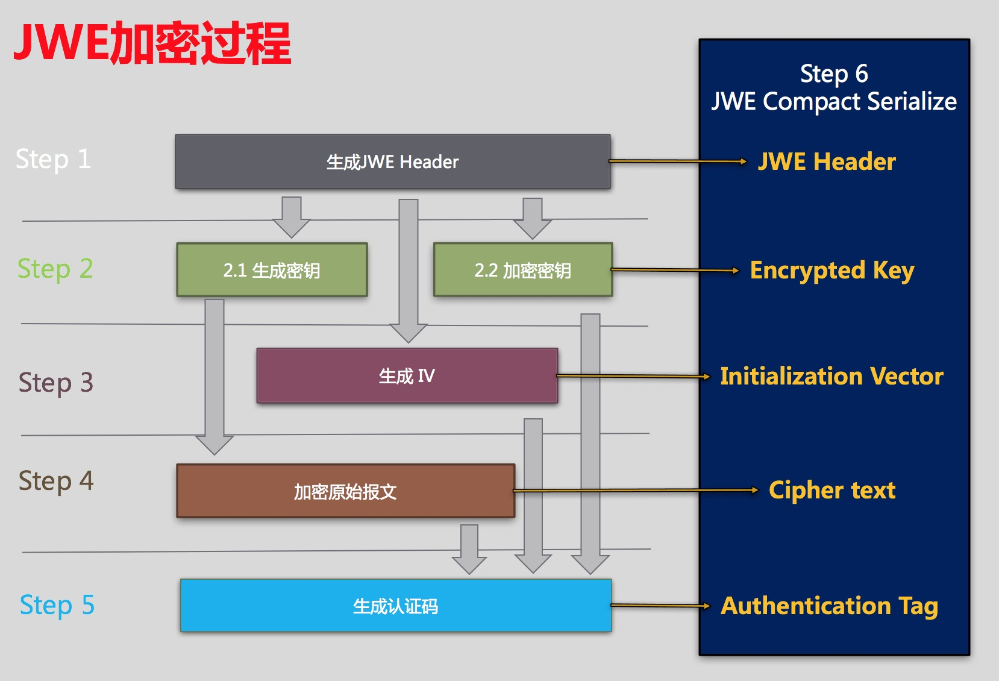
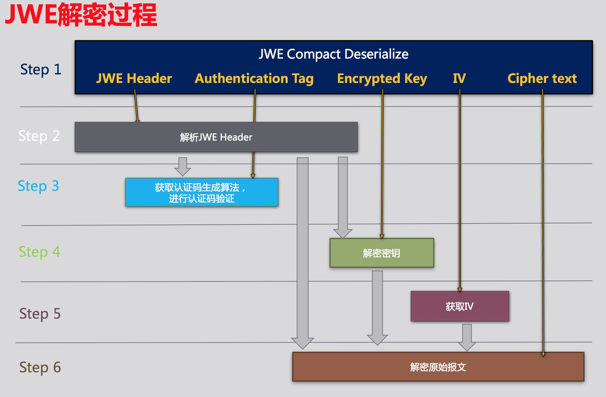

#【基础篇】(一)初始JWE-揭开JWE神秘面纱
## 1.疑问

在正式介绍JWE之前，抛几个问题。之前跟使用过JWE的小伙伴聊天，问他们对JWE的了解，大致如下：

甲：听说JWE很牛X，使用的时候都是封装好的，不知道原理是什么？

乙：听说用到了很多加密算法，什么RSA、AES之类的，不太懂？

丙：还需要公钥、私钥证书等等，联调的时候总是出问题，不知哪里出问题？

总结了下，问题大致如下：

> _**1.JWE的本质是什么，原理是怎样。**_
>
> _**2.JWE与加密算法RSA、AES等的有什么关系和差异。**_
>
> _**3.JWE中的密钥怎么选择与使用。**_

带着疑问，我们进入正题，一步一步来找到答案。

## 2.什么是JWE

JWE是JSON Web Encryption的缩写，顾名思义可以理解成JSON格式的网络加密。首先我们了解下JWE长什么样？

### 2.1JWE长什么样

首先，看一个JWE处理后的实例数据：

```
eyJhbGciOiJSU0EtT0FFUCIsImVuYyI6IkEyNTZHQ00ifQ.
OKOawDo13gRp2ojaHV7LFpZcgV7T6DVZKTyKOMTYUmKoTCVJRgckCL9kiMT03JGe
ipsEdY3mx_etLbbWSrFr05kLzcSr4qKAq7YN7e9jwQRb23nfa6c9d-StnImGyFDb
Sv04uVuxIp5Zms1gNxKKK2Da14B8S4rzVRltdYwam_lDp5XnZAYpQdb76FdIKLaV
mqgfwX7XWRxv2322i-vDxRfqNzo_tETKzpVLzfiwQyeyPGLBIO56YJ7eObdv0je8
1860ppamavo35UgoRdbYaBcoh9QcfylQr66oc6vFWXRcZ_ZT2LawVCWTIy3brGPi
6UklfCpIMfIjf7iGdXKHzg.
48V1_ALb6US04U3b.
5eym8TW_c8SuK0ltJ3rpYIzOeDQz7TALvtu6UG9oMo4vpzs9tX_EFShS8iB7j6ji
SdiwkIr3ajwQzaBtQD_A.
XFBoMYUZodetZdvTiFvSkQ
```

#### 特点1.整个数据为5段，以"."作为分隔符，形如:aaa.bbb.ccc.ddd.eee

BINGO！但是为什么会用.作为分隔符呢？
个人理解，作为分隔符，只要能达到与内容区别、不重复的目的，什么符号都可以。比如："\|"\(竖线\)、"\_"\(空格\)等。

#### 特点2.每段数据均为Base64UrlEncode数据

JWE序列化的数据包含5段，内容分别如下：

```
BASE64URL(UTF8(JWE Protected Header)) || '.' ||
BASE64URL(JWE Encrypted Key) || '.' ||
BASE64URL(JWE Initialization Vector) || '.' ||
BASE64URL(JWE Ciphertext) || '.' ||
BASE64URL(JWE Authentication Tag)
```

详见：[http://self-issued.info/docs/draft-ietf-jose-json-web-encryption.html\#rfc.section.3.1](http://self-issued.info/docs/draft-ietf-jose-json-web-encryption.html#rfc.section.3.1)

下面是Base64UrlDecode之后数据对比：

| Section | Base64UrlEncode | Base64UrlDecode |
| :--- | :--- | :--- |
| UTF8\(JWE Protected Header\) | eyJhbGciOiJSU0EtT0FFUCIsImVuYyI6IkEyNTZHQ00ifQ | {"alg":"RSA-OAEP","enc":"A256GCM"} |
| JWE Encrypted Key | OKOawDo13gRp2ojaHV7LFpZcgV7T6DVZKTyKOMTYUmKoTCVJRgckCL<br>9kiMT03JGeipsEdY3mx\_etLbbWSrFr05kLzcSr4qKAq7YN7e9jwQR<br>b23nfa6c9dStnImGyFDbSv04uVuxIp5Zms1gNxKKK2Da14B8S4rzVR<br>ltdYwam\_lDp5XnZAYpQdb76FdIKLaVmqgfwX7XWRxv2322ivDxRfq<br>Nzo\_tETKzpVLzfiwQyeyPGLBIO56YJ7eObdv0je81860ppamavo35<br>UgoRdbYaBcoh9QcfylQr66oc6vFWXRcZ\_ZT2LawVCWTIy3brGPi6U<br>klfCpIMfIjf7iGdXKHzg | 8:5ބiڈڝ^˖\^Ө5Y\)<8ĘRbL%IF$dĴܑu慫KmZ悳q\*\*탻{ذA޷کϝJوlӋ\)噬փq\(xĸ5QטiW\[ ږjdqmګÅ귺-2R~,ɬH;'m۴ﵳ\)Ruʡʔ+몜걖\]e=kBY22ݺƾ.W¤"7gW\(\| |
| JWE Initialization Vector | 48V1\_ALb6US04U3b | ㅵQ-8Sv |
| JWE Ciphertext | 5eym8TW\_c8SuK0ltJ3rpYIzOeDQz7TALvtu6UG9oMo4vpzs9tX\_<br>EFShS8iB7j6jiSdiwkIr3ajwQzaBtQD\_A | 嬦5+қI޺X\#3Lﶮڌ鎏m\AR/"$ vLچԃ |
| JWE Authentication Tag | XFBoMYUZodetZdvTiFvSkQ | \Ph1׭eۓ\[ґ |

从上面的数据可以看出，除了第一段\(UTF8\(JWE Protected Header\)\)是字符串明文之外，其他部分是非字符串明文，或者是2进制数据，或者为加密数据。

### 2.2JWE的内容结构

从上文知道JWE序列化的数据结构包含5部分，下面针对这5部分具体描述：

| Section | Description | 数据格式 | 是否可以为空 | 是否加密 | Examples |
| :--- | :--- | :--- | :--- | :--- | :--- |
| JWE Protected Header | JOSE Header数据，主要包含：alg，enc，zip，kid等字段。没有加密处理 | 字符串，JSON格式 | 否 | 否 | {"alg":"RSA-OAEP","enc":"A256GCM"} |
| JWE Encrypted Key | 加密后的密钥数据。有密钥的加密算法会涉及到，比如AES，RSA。 | 2进制 | 是 | 是 | |
| JWE Initialization Vector | 向量数据。涉及到向量的加密算法才有此数据，比如：AES | 2进制 | 是 | 否 | |
| JWE Ciphertext | 原始数据加密后的密文。 | 2进制 | 否 | 是 | |
| JWE Authentication Tag | 签名数据，对JWE Encrypted Key+JWE Initialization Vector+JWE Ciphertext 整合数据的签名。比如SHA1、HMAC的签名结果。 | 2进制 | 否 | 是 | |

接下来可以简单的描述JWE数据结构：

```
数据头(明文，非空) . 密钥（密文，可空）. 向量(二进制，可空) . 密文（密文，非空）. 签名数据（密文，非空）
```

综上，我们了解了JWE产生的数据结构，接下来我们来看下怎样一步一步生成JWE的数据。

## 3.JWE的工作原理

#### 3.1 加密算法选择

从前文我们了解到，整个JWE的结构中有3部分的数据需要进行加密处理：密钥\(Section 2\)、密文\(Section 4）、签名\(Section 5\)，意思就是JWE过程中需要用到三次加密，分别是：

> 1. 原始报文的加密
> 2. 密钥的加密
> 3. 数字签名

在真正JWE处理的过程之前，我们必须把以上三种算法确定好。拿我们团队实践的算法来举例：

| 过程 | 算法名 |
| :--- | :--- |
| 原始报文的加密 | AES 128 |
| 密钥的加密 | RSA PKCS1 |
| 签名 | HMAC with SHA256 |

到了这里，有的童鞋肯定会问：

1，这些算法都是随意指定的吗？

2，解密方怎么知道加密方分别用的是什么算法 ？

BINGO！JWE设计的时候，为了支持这种灵活的扩展，JWE的Header里面就用了相应的字段进行描述：

| 字段名 | 描述 | 实例 | 实例说明 |
| :--- | :--- | :--- | :--- |
| alg | 用来描述密钥的加密算法 | {"alg":"RSA1\_5"} | 密钥加密算法为RSA,padding方式为：pkcs1-v1\_5 |
| enc | 用来描述原始报文的加密算法和签名算法 | {"enc":"A128CBC-HS256"} | A128CBC：原始报文的加密算法为AES128，提供商为CBC。HS256：签名算法为HMAC With SHA256 |

关于JWE Header的描述，更详尽的请查看：[http://self-issued.info/docs/draft-ietf-jose-json-web-encryption.html\#Header](http://self-issued.info/docs/draft-ietf-jose-json-web-encryption.html#Header)

以上的例子整合的Header为：

```
{"alg":"RSA1_5","enc":"A128CBC-HS256"}
```

这样约束好之后，加密和解密都按照约束的算法进行操作。

#### 3.2 JWE数据加密过程

知道了JWE的结构之后，我们根据这个结构来了解下它的数据处理过程，流程简单描述如下：

> _**step 1. 选择算法，生成JWEHeader**_
>
> _**step 2. 生成密钥并且加密密钥，得到Encrypted Key**_
>
> _**step 3. 生成向量数据，得到Initialization Vector**_
>
> _**step 4. 加密原始报文，得到Cipher text**_
>
> _**step 5. 签名，得到Authentication Tag**_
>
> _**step 6. 拼接以及序列号数据，得到JWE Object**_

图示如下：


#### 3.3 JWE加密完整实例

如果上图还无法很好的理解，下面举个例来说明整个过程：

> _**step 1. 选择算法，生成JWEHeader**_
>
> 密钥加密算法为RSA,padding方式为：pkcs1-v1\_5
>
> 原始报文的加密算法为AES128，提供商为CBC。HS256：签名算法为HMAC With SHA256
>
> JWEHeader为：{"alg":"RSA1\_5","enc":"A128CBC-HS256"}
>
> _**step 2. 生成密钥并且加密密钥，得到Encrypted Key**_
>
> 随机生成一组AES的Key，长度为128，然后用RSA -pkcs1-v1\_5进行加密。
>
> _注：此处用的RSA的公钥_
>
> _**step 3. 生成向量数据，得到Initialization Vector**_
>
> 随机生成一组向量数据。
>
> _**step 4. 加密原始报文，得到Cipher text**_
>
> 利用step2的密钥 和 step3的向量数据，用AES\(CBC\)128加密
>
> _**step 5. 签名，得到Authentication Tag**_
>
> 把step2的加密密钥、step3的向量、step4的密文 进行拼接，然后用HMAC With SHA256 算法进行签名
>
> _**step 6. 拼接以及序列号数据，得到JWE Object**_
>
> 把以上5个步骤的数据进行Base64UrlEncode，然后按照顺序拼接，用"."分割，得到最后的数据。

图示如下：


#### 3.4 JWE解密过程

了解了JWE的加密过程，解密就是它的逆向过程，大致流程如下：

> _**step 1. 反序列化JWE Object，得到5部分数据**_
>
> _**step 2. 解析JWEHeader，得到具体的算法**_
>
> _**step 3. 拿到签名算法，进行签名校验**_
>
> _**step 4. 对Encrypted Key进行解密，得到密钥明文**_
>
> _**step 5. 解析向量数据**_
>
> _**step 5. 拿到加密算法，用密钥对其解密**_

图示如下：


#### 3.5 JWE解密完整实例

> _**step 1. 反序列化JWE Object，得到5部分数据**_
>
> 通过"."拆分每段，Base64UrlDecode每个部分
>
> _**step 2. 解析JWEHeader，得到具体的算法**_
>
> Header的数据为{"alg":"RSA1\_5","enc":"A128CBC-HS256"}，密钥加密算法为RSAPKCS1-V1\_5，报文加密算法为 AES128，签名算法为HMAC With SHA256.
>
> _**step 3. 拿到签名算法，进行签名校验**_
>
> 通过HMAC With SHA256验证签名。
>
> _**step 4. 对Encrypted Key进行解密，得到密钥明文**_
>
> 通过RSA对Encrypted Key进行解密，得到密钥明文
>
> _**step 5. 解析向量数据**_
>
> 直接从Object取出IV数据
>
> _**step 6. 拿到加密算法，用密钥对其解密**_
>
> 用AES128算法，对ciphertext解

图解如下：


## 4.JWE的本质

通过上文的简单介绍，我们可以简单总结下JWE的一些特质：

#### 1.JWE是一个数据加解密协议(protocol)，是一种流程和数据结构的规范。
JWE本身不是算法，是通过结构和流程约束(protocol)，根据指定的算法以及依赖进行数据加解密操作。
#### 2.JWE有着非常强的定制性和可扩展性。
开发者们可根据自己的需求，设定非常奇特的加解密算法来实现具体的加解密过程。

# 完结

该篇文章暂时介绍到此，请关注该系列其他文章，持续更新中，尽请期待。
> _**1.JWE与加密算法RSA、AES等的有什么关系和差异。**_
>
> _**2.JWE中的密钥怎么选择与使用。**_

这两个问题会在后面的文章中解答

关于JWE最权威、最详细的信息请查看：[http://self-issued.info/docs/draft-ietf-jose-json-web-encryption.html](http://self-issued.info/docs/draft-ietf-jose-json-web-encryption.html)。
